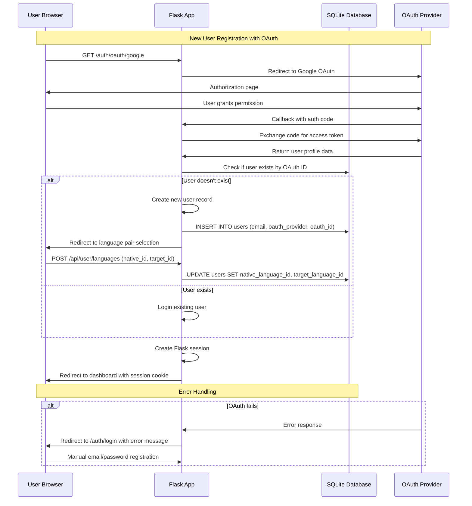
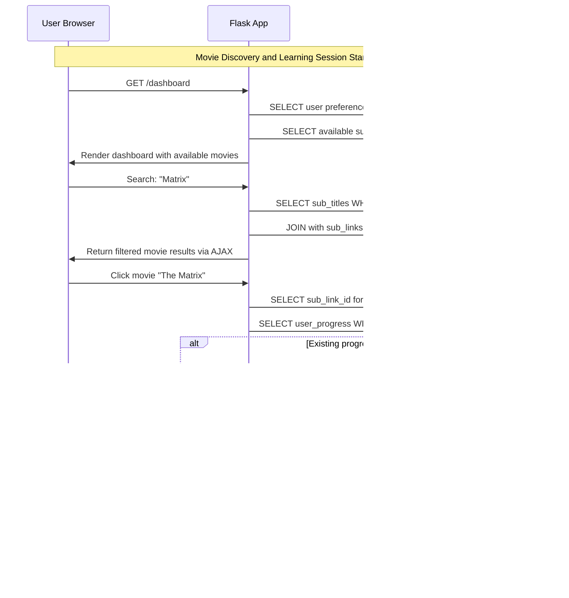
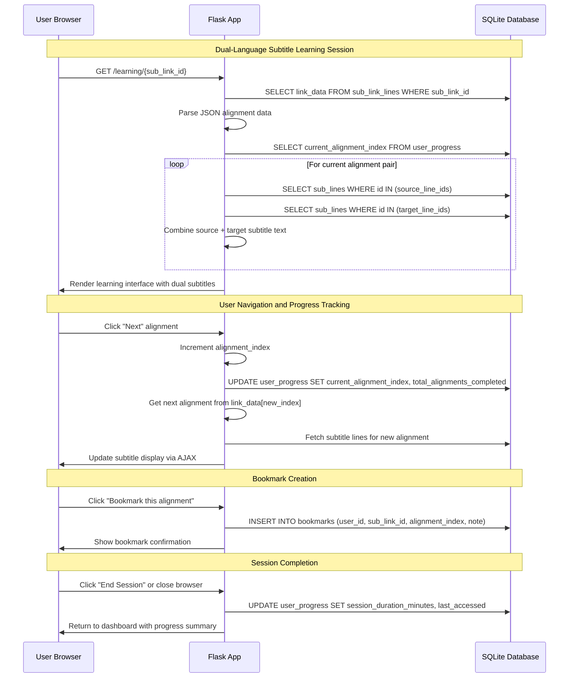

# Core Workflows

## New User Registration with OAuth

```mermaid
sequenceDiagram
    participant U as User Browser
    participant F as Flask App
    participant DB as SQLite Database
    participant O as OAuth Provider

    Note over U,O: New User Registration with OAuth

    U->>F: GET /auth/oauth/google
    F->>O: Redirect to Google OAuth
    O->>U: Authorization page
    U->>O: User grants permission
    O->>F: Callback with auth code
    F->>O: Exchange code for access token
    O->>F: Return user profile data
    F->>DB: Check if user exists by OAuth ID
    
    alt User doesn't exist
        F->>F: Create new user record
        F->>DB: INSERT INTO users (email, oauth_provider, oauth_id)
        F->>U: Redirect to language pair selection
        U->>F: POST /api/user/languages (native_id, target_id)
        F->>DB: UPDATE users SET native_language_id, target_language_id
    else User exists
        F->>F: Login existing user
    end
    
    F->>F: Create Flask session
    F->>U: Redirect to dashboard with session cookie

    Note over U,DB: Error Handling
    alt OAuth fails
        O->>F: Error response
        F->>U: Redirect to /auth/login with error message
        U->>F: Manual email/password registration
    end
```

## Movie Discovery and Learning Session Start

```mermaid
sequenceDiagram
    participant U as User Browser
    participant F as Flask App
    participant DB as SQLite Database

    Note over U,DB: Movie Discovery and Learning Session Start

    U->>F: GET /dashboard
    F->>DB: SELECT user preferences (native_lang, target_lang)
    F->>DB: SELECT available sub_links for language pair
    F->>U: Render dashboard with available movies

    U->>F: Search: "Matrix" 
    F->>DB: SELECT sub_titles WHERE title LIKE '%Matrix%'
    F->>DB: JOIN with sub_links for user's language pair
    F->>U: Return filtered movie results via AJAX

    U->>F: Click movie "The Matrix"
    F->>DB: SELECT sub_link_id for Matrix + user language pair
    F->>DB: SELECT user_progress WHERE user_id AND sub_link_id
    
    alt Existing progress found
        F->>DB: SELECT link_data from sub_link_lines
        F->>F: Resume at current_alignment_index
    else No progress
        F->>F: Start at alignment index 0
        F->>DB: INSERT INTO user_progress (initial record)
    end

    F->>U: Redirect to /learning/{sub_link_id}
```

## Dual-Language Subtitle Learning Session

```mermaid
sequenceDiagram
    participant U as User Browser
    participant F as Flask App
    participant DB as SQLite Database

    Note over U,DB: Dual-Language Subtitle Learning Session

    U->>F: GET /learning/{sub_link_id}
    F->>DB: SELECT link_data FROM sub_link_lines WHERE sub_link_id
    F->>F: Parse JSON alignment data
    F->>DB: SELECT current_alignment_index FROM user_progress
    
    loop For current alignment pair
        F->>DB: SELECT sub_lines WHERE id IN (source_line_ids)
        F->>DB: SELECT sub_lines WHERE id IN (target_line_ids)
        F->>F: Combine source + target subtitle text
    end
    
    F->>U: Render learning interface with dual subtitles

    Note over U,DB: User Navigation and Progress Tracking
    
    U->>F: Click "Next" alignment
    F->>F: Increment alignment_index
    F->>DB: UPDATE user_progress SET current_alignment_index, total_alignments_completed
    F->>F: Get next alignment from link_data[new_index]
    F->>DB: Fetch subtitle lines for new alignment
    F->>U: Update subtitle display via AJAX

    Note over U,DB: Bookmark Creation
    
    U->>F: Click "Bookmark this alignment"
    F->>DB: INSERT INTO bookmarks (user_id, sub_link_id, alignment_index, note)
    F->>U: Show bookmark confirmation

    Note over U,DB: Session Completion
    
    U->>F: Click "End Session" or close browser
    F->>DB: UPDATE user_progress SET session_duration_minutes, last_accessed
    F->>U: Return to dashboard with progress summary
```
