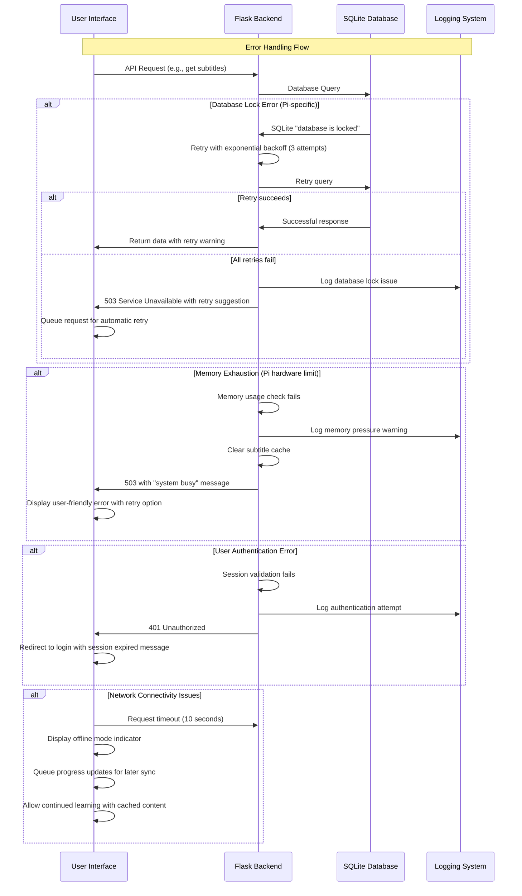

# Error Handling Strategy

## Error Flow



## Error Response Format

```typescript
interface ApiError {
  error: {
    code: string;           // Machine-readable error code
    message: string;        // Human-readable error message
    details?: Record<string, any>;  // Additional error context
    timestamp: string;      // ISO timestamp for debugging
    requestId: string;      // Unique request identifier for Pi logs
    retryable?: boolean;    // Whether client should retry request
    retryAfter?: number;    // Seconds to wait before retry
  };
}
```
