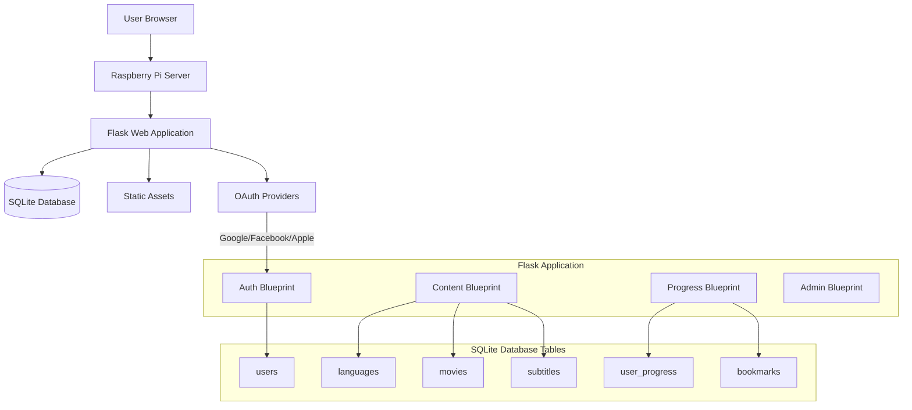

# High Level Architecture

## Technical Summary

SubLearning employs a **monolithic Flask web application** architecture with **server-side rendered templates** and **progressive enhancement** through vanilla JavaScript. The platform utilizes **SQLite database** for all data storage including user information, progress tracking, movie metadata, and **subtitle content**. **OAuth integration** enables social authentication alongside traditional email/password flows, while **responsive Bootstrap-based frontend** ensures optimal viewing across devices with desktop-first optimization. This architecture achieves the PRD's dual-language learning goals through **synchronized subtitle display** served from database queries, **persistent progress tracking** across sessions, and **efficient content discovery** through search and alphabetical browsing.

## Platform and Infrastructure Choice

**Platform:** Raspberry Pi Local Server  
**Key Services:** 
- Flask application (local Python server)
- SQLite database (user data, movies, subtitles, progress)
- Static assets (CSS, JS, images only)
- Local network or port forwarding for access

**Deployment Host and Regions:** Single Raspberry Pi location (local network)

## Repository Structure

For SubLearning's monolithic Flask application with clear separation of concerns, I recommend a **single repository structure** with organized modules rather than a monorepo approach.

**Structure:** Monolithic Flask application with modular blueprints
**Monorepo Tool:** Not applicable (single application)
**Package Organization:** Blueprint-based organization separating authentication, content, progress, and admin concerns

## High Level Architecture Diagram

## Architectural Patterns

- **MVC Architecture:** Flask blueprints as controllers, Jinja2 templates as views, SQLAlchemy models for data layer - _Rationale:_ Clear separation of concerns and familiar pattern for Flask development
- **Repository Pattern:** Abstract database access through service layer classes - _Rationale:_ Enables easier testing and optimized subtitle querying
- **Database-Centric Content:** All subtitle content stored in SQLite with efficient indexing - _Rationale:_ Enables complex queries, search functionality, and consistent data management
- **Progressive Enhancement:** Core functionality works without JavaScript, enhanced with AJAX - _Rationale:_ Ensures accessibility and performance for Raspberry Pi constraints
- **Blueprint Modularization:** Separate Flask blueprints for auth, content, progress, and admin - _Rationale:_ Maintainable code organization despite single-database approach
