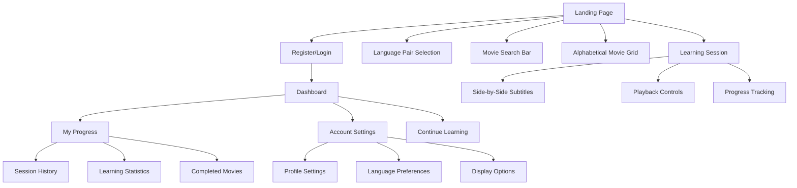
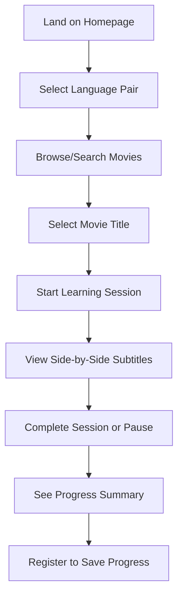
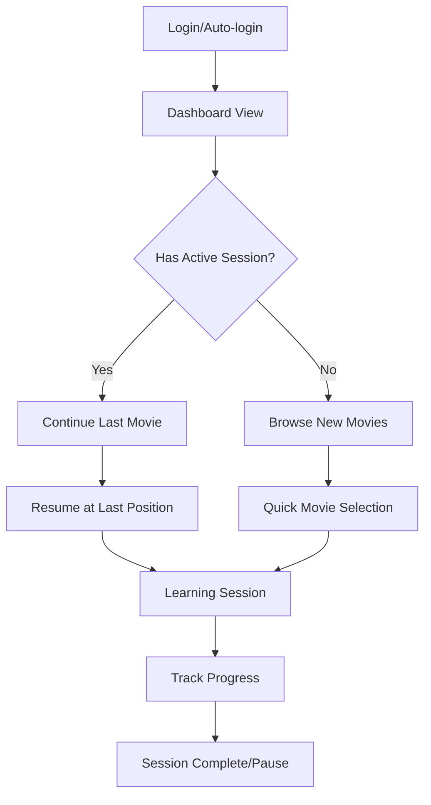
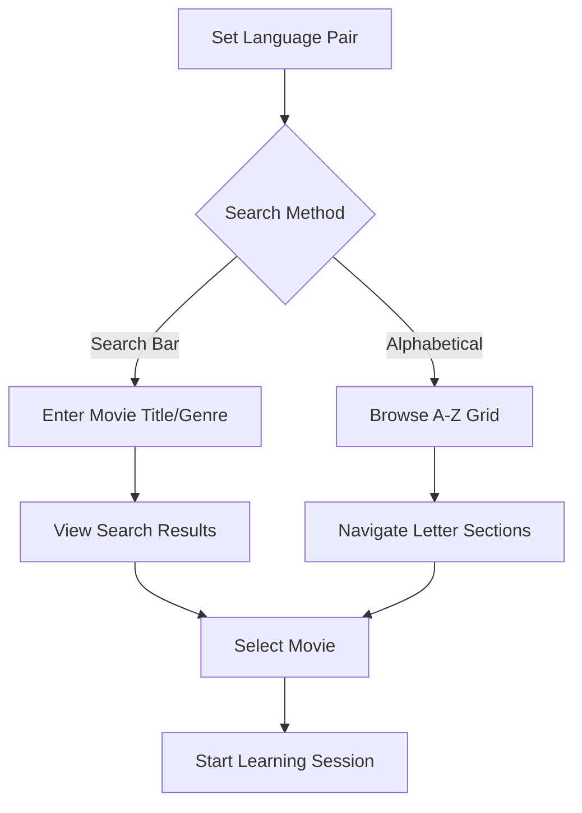

# SubLearning UI/UX Specification

This document defines the user experience goals, information architecture, user flows, and visual design specifications for SubLearning's user interface. It serves as the foundation for visual design and frontend development, ensuring a cohesive and user-centered experience.

## Overall UX Goals & Principles

### Target User Personas

**Time-Pressed Adult Learner:** Working professionals (ages 25-45) with limited daily time (15-30 minutes) who want to combine entertainment with language learning. Values efficiency and measurable progress over extended study sessions.

**Movie Enthusiast Learner:** Adults passionate about foreign films/culture who want to enhance their viewing experience while acquiring language skills. Seeks authentic cultural context through real movie content.

**Career-Focused Language Learner:** Professionals preparing for international business interactions or travel who need practical, conversational language skills rather than academic grammar.

### Usability Goals

**Cognitive load management:** Present dual-language subtitles without overwhelming users, optimizing for the "cognitive bridging" learning mechanism  
**Time-conscious engagement:** Enable meaningful learning progress in 15-20 minute sessions with 90%+ completion rates  
**Frustration minimization:** Reduce negative emotions that impede learning through intuitive interface and immediate feedback  
**Progress transparency:** Provide clear advancement indicators (lines completed, accuracy improvement) to justify time investment  
**Entertainment-learning balance:** Maintain movie enjoyment while facilitating active language acquisition

### Design Principles

1. **Cognitive bridging first** - Every interface element supports connecting new language to existing experience through movie context
2. **Time-respectful design** - Honor users' 15-30 minute availability with bite-sized sessions and persistent progress
3. **Authentic over artificial** - Prioritize real movie dialogue and cultural context over contrived learning scenarios
4. **Immediate visual feedback** - Provide instant responses to user actions, especially for translation attempts
5. **Engagement without overwhelm** - Balance gamification with simplicity to avoid cognitive overload during learning

### Change Log

| Date | Version | Description | Author |
|------|---------|-------------|--------|
| 2025-08-18 | 1.0 | Initial UI/UX specification created | Sally (UX Expert) |

## Information Architecture (IA)

### Site Map / Screen Inventory

### Navigation Structure

**Primary Navigation:** 
- Logo/Home (returns to landing page with full movie selection)
- Dashboard (for registered users - progress and continue learning)
- Account (settings and login/register)

**Secondary Navigation:** 
- Language pair selector (prominently featured on landing page)
- Movie search and filtering (integrated into landing page)
- Session controls within Learning interface

**Breadcrumb Strategy:** 
Simple path: [Movie Title] > Learning Session
Direct selection from landing page eliminates intermediate pages

## User Flows

### New User First-Time Learning Flow

**User Goal:** Start learning a language through movie subtitles for the first time

**Entry Points:** Landing page (direct or from marketing)

**Success Criteria:** Complete first learning session with dual-language subtitles

**Edge Cases & Error Handling:**
- No movies available for selected language pair → Show message with alternative languages
- Subtitle synchronization fails → Provide retry option and fallback text display
- User leaves mid-session → Offer quick registration to save progress
- Slow subtitle loading → Show loading indicators and estimated wait time

**Notes:** This flow prioritizes immediate value delivery - users can start learning before registering, reducing friction for busy professionals testing the platform.

### Returning User Quick Start Flow

**User Goal:** Continue learning or start new movie efficiently

**Entry Points:** Bookmark/direct URL, email reminders

**Success Criteria:** Resume or start learning within 30 seconds

**Edge Cases & Error Handling:**
- Last session data corrupted → Offer restart from movie beginning
- User wants different movie than last session → Provide easy navigation back to selection
- Login session expired → Seamless re-authentication without losing movie choice

**Notes:** Optimized for the 15-20 minute session target, minimizing setup time to maximize learning time.

### Movie Discovery & Selection Flow

**User Goal:** Find appropriate movie content for current learning level and interests

**Entry Points:** Landing page, dashboard "browse movies" 

**Success Criteria:** Select movie and begin learning session

**Edge Cases & Error Handling:**
- No search results found → Suggest similar titles or browse alternatives
- Movie unavailable for language pair → Show available alternatives
- Overwhelmed by choice → Provide "recommended for beginners" or "popular" filters

**Notes:** Balances quick access for users who know what they want with discovery for exploratory learners.

## Wireframes & Mockups

**Primary Design Files:** To be created in Figma - [Design files will be linked here once created]

### Key Screen Layouts

#### Landing Page Layout

**Purpose:** Serve as the primary content discovery and selection hub

**Key Elements:**
- Header with SubLearning logo and login/register buttons
- Language pair selector (prominent, above-the-fold)
- Movie search bar with real-time filtering
- Alphabetical movie grid (A-Z navigation tabs + movie titles)
- Footer with help/about links

**Interaction Notes:** Language selection instantly filters movie grid; search provides real-time results; movie title click immediately launches learning session

**Design File Reference:** [Figma: Landing Page - Main Hub]

#### Learning Session Interface

**Purpose:** Core dual-language subtitle learning experience

**Key Elements:**
- Movie title and progress indicator at top
- Dual-language subtitle display area (side-by-side layout)
- Playback controls (play/pause, subtitle navigation, speed adjustment)
- Session timer and lines completed counter
- Exit/pause session button with progress save prompt

**Interaction Notes:** Subtitle timing synchronized with playback; progress auto-saves; clear visual hierarchy prioritizes subtitle content over controls

**Design File Reference:** [Figma: Learning Session - Subtitle Interface]

#### Dashboard Layout

**Purpose:** Progress tracking and quick access for returning users

**Key Elements:**
- Welcome message with current learning streak
- "Continue Learning" card showing last movie and position
- Quick stats: movies completed, hours learned, accuracy improvement
- Recent activity feed
- Quick access to browse new movies

**Interaction Notes:** Continue button resumes exactly where user left off; stats provide motivation without overwhelming; one-click access to new content

**Design File Reference:** [Figma: Dashboard - Progress Hub]

## Component Library / Design System

**Design System Approach:** Start with Bootstrap 5 as the foundation, customizing key components for language learning contexts. Create a minimal but consistent component library focused on readability, quick interaction, and progress feedback.

### Core Components

#### Language Pair Selector

**Purpose:** Allow users to select their native and target language combination

**Variants:** 
- Dropdown pair selector (compact)
- Button grid selector (visual)
- Quick-switch toggle for frequent language pairs

**States:** Default, selecting, selected, error (no content available)

**Usage Guidelines:** Always visible in header; selection should instantly filter available content; provide clear visual feedback when switching

#### Movie Title Card

**Purpose:** Display movie information for selection on landing page

**Variants:**
- Grid view (title + basic info)
- List view (compact for search results)
- Continue learning (with progress indicator)

**States:** Default, hover, selected, in-progress, completed

**Usage Guidelines:** Single click to start learning; progress indicators for returning users; clear visual hierarchy for title vs. metadata

#### Subtitle Display Panel

**Purpose:** Core learning interface showing dual-language subtitles

**Variants:**
- Side-by-side layout (default)
- Stacked layout (mobile/narrow screens)
- Single language mode (advanced users)

**States:** Active line, completed lines, upcoming lines, loading

**Usage Guidelines:** High contrast text for readability; synchronized highlighting; adjustable font sizes; clear language labeling

#### Progress Indicator

**Purpose:** Show learning advancement and maintain motivation

**Variants:**
- Session progress (current movie completion)
- Overall progress (lines completed, time invested)
- Accuracy tracking (future: translation performance)

**States:** In-progress, completed, milestone achieved

**Usage Guidelines:** Prominent placement without overwhelming content; celebrate achievements; clear time/completion metrics

#### Session Controls

**Purpose:** Manage playback and learning session flow

**Variants:**
- Play/pause toggle
- Speed adjustment slider
- Subtitle navigation (previous/next)
- Session management (save/exit)

**States:** Playing, paused, loading, error

**Usage Guidelines:** Accessible during subtitle reading; non-intrusive placement; clear icons with text labels

## Branding & Style Guide

**Brand Guidelines:** SubLearning's visual identity should convey trust, learning effectiveness, and accessibility while maintaining the engaging entertainment aspect of movie-based learning.

### Color Palette

| Color Type | Hex Code | Usage |
|------------|----------|-------|
| Primary | #2563EB | Navigation, primary buttons, active language selection |
| Secondary | #7C3AED | Accent elements, progress indicators, achievements |
| Accent | #059669 | Success states, completed progress, positive feedback |
| Success | #10B981 | Confirmations, successful translations, streak achievements |
| Warning | #F59E0B | Important notices, subtitle sync issues, session timeouts |
| Error | #EF4444 | Errors, failed actions, connection problems |
| Neutral | #64748B, #F1F5F9, #1E293B | Text hierarchy, borders, background variations |

### Typography

#### Font Families
- **Primary:** Inter (clean, highly readable for UI text and subtitles)
- **Secondary:** Source Serif Pro (for movie titles and headings, adds entertainment feel)
- **Monospace:** JetBrains Mono (for any code-like elements or precise alignment)

#### Type Scale

| Element | Size | Weight | Line Height |
|---------|------|--------|-------------|
| H1 | 2.25rem (36px) | 700 | 1.2 |
| H2 | 1.875rem (30px) | 600 | 1.3 |
| H3 | 1.5rem (24px) | 600 | 1.4 |
| Body | 1rem (16px) | 400 | 1.6 |
| Small | 0.875rem (14px) | 400 | 1.5 |

### Iconography

**Icon Library:** Heroicons (consistent with modern web standards, excellent readability)

**Usage Guidelines:** Use outline style for inactive states, filled style for active states; maintain 24px standard size for primary actions; language flags for language selection where appropriate

### Spacing & Layout

**Grid System:** Bootstrap 5's 12-column responsive grid with custom container max-widths

**Spacing Scale:** 
- Base unit: 0.25rem (4px)
- Common spacings: 0.5rem, 1rem, 1.5rem, 2rem, 3rem, 4rem
- Subtitle panel padding: 1.5rem for comfortable reading
- Component margins: 1rem standard, 2rem for section separation

## Accessibility Requirements

Accessibility is critical for SubLearning since language learning should be available to all users, and the subtitle-based learning method inherently serves users who might have hearing difficulties.

### Compliance Target

**Standard:** WCAG 2.1 Level AA compliance as baseline, with Level AAA considerations for text and subtitle display

### Key Requirements

**Visual:**
- Color contrast ratios: 4.5:1 minimum for normal text, 3:1 for large text (>18px), 7:1 for subtitle text to ensure readability during learning
- Focus indicators: 2px solid outline with 4.5:1 contrast ratio, visible on all interactive elements including subtitle navigation
- Text sizing: Support browser zoom up to 200% without horizontal scrolling, subtitle text scalable from 14px to 24px minimum

**Interaction:**
- Keyboard navigation: Full functionality accessible via keyboard, logical tab order through language selector → movie selection → subtitle controls
- Screen reader support: ARIA labels for all learning progress elements, subtitle content properly announced, clear headings structure (H1 for page, H2 for sections)
- Touch targets: Minimum 44px × 44px for all interactive elements, especially playback controls and movie selection

**Content:**
- Alternative text: Descriptive alt text for movie poster images, clear labeling for language pair selections
- Heading structure: Logical H1-H6 hierarchy for screen reader navigation, movie titles as H3, learning sections as H2
- Form labels: Explicit labels for search inputs, clear error messages for failed movie loads or subtitle sync issues

### Testing Strategy

**Automated Testing:** axe-core integration in development workflow to catch basic accessibility violations

**Manual Testing:** 
- Keyboard-only navigation testing for complete user flows
- Screen reader testing with NVDA/JAWS for subtitle announcement and progress tracking
- Color contrast verification for all subtitle display combinations
- Browser zoom testing up to 200% for responsive subtitle layouts

**User Testing:** Include users with visual impairments in usability testing, particularly for subtitle readability and navigation efficiency

## Responsiveness Strategy

SubLearning must work effectively across devices since busy professionals use various devices throughout their day, though the brief indicates web-first with desktop/laptop as primary usage.

### Breakpoints

| Breakpoint | Min Width | Max Width | Target Devices |
|------------|-----------|-----------|----------------|
| Mobile | 320px | 767px | Smartphones, quick session access |
| Tablet | 768px | 1023px | iPads, casual learning sessions |
| Desktop | 1024px | 1439px | Laptops, primary learning environment |
| Wide | 1440px | - | Large monitors, extended learning sessions |

### Adaptation Patterns

**Layout Changes:** 
- Mobile: Single-column subtitle display (stacked native/target language)
- Tablet: Flexible side-by-side or stacked based on orientation
- Desktop: Optimal side-by-side subtitle layout with maximum readability
- Wide: Enhanced spacing and larger subtitle text for comfortable viewing

**Navigation Changes:** 
- Mobile: Hamburger menu for account/settings, prominent language selector
- Tablet: Condensed horizontal navigation with touch-optimized targets
- Desktop: Full horizontal navigation with hover states
- Wide: Extended navigation with additional quick-access options

**Content Priority:** 
- Mobile: Subtitle content prioritized, minimal UI chrome, essential controls only
- Tablet: Balanced subtitle focus with accessible progress indicators
- Desktop: Full feature set with subtitle content and comprehensive controls
- Wide: Enhanced subtitle presentation with optional advanced features

**Interaction Changes:** 
- Mobile: Touch-optimized controls (44px minimum), swipe gestures for subtitle navigation
- Tablet: Touch and keyboard support, larger subtitle text for readability
- Desktop: Keyboard shortcuts, mouse hover states, precise click targets
- Wide: Enhanced keyboard shortcuts, optional mouse-over subtitle translations

## Animation & Micro-interactions

For SubLearning, animations should enhance the learning experience without distracting from subtitle comprehension or overwhelming time-pressed users.

### Motion Principles

**Learning-focused motion:** All animations serve educational purposes - highlighting progress, providing feedback, or guiding attention to learning content. Avoid decorative animations that compete with subtitle reading.

**Respectful timing:** Quick, efficient animations (150-300ms) that don't waste users' limited 15-30 minute learning windows. Users should feel the interface is responsive, not sluggish.

**Cognitive load awareness:** Minimal simultaneous animations to preserve mental capacity for language processing. Subtle transitions that support rather than distract from learning flow.

### Key Animations

- **Subtitle highlight transition:** Active subtitle line fades in with gentle background color change (Duration: 200ms, Easing: ease-out)
- **Progress bar growth:** Learning progress animates smoothly as users complete lines (Duration: 300ms, Easing: ease-in-out)
- **Language pair selection:** Smooth dropdown expansion with slight bounce for feedback (Duration: 250ms, Easing: ease-back)
- **Movie card hover state:** Gentle scale and shadow increase on movie selection hover (Duration: 150ms, Easing: ease-out)
- **Session transition:** Fade between movie selection and learning interface (Duration: 400ms, Easing: ease-in-out)
- **Achievement notification:** Celebratory slide-in for completed sessions or milestones (Duration: 500ms, Easing: ease-bounce)
- **Error state feedback:** Gentle shake for failed searches or connection issues (Duration: 300ms, Easing: ease-out)
- **Loading indicators:** Smooth spinner for subtitle loading, avoiding jarring state changes (Duration: continuous, Easing: linear)

## Performance Considerations

Performance is critical for SubLearning since subtitle synchronization and quick session starts directly impact the learning experience for time-pressed users.

### Performance Goals

- **Page Load:** Initial landing page loads in under 2 seconds on standard broadband, learning session starts within 3 seconds
- **Interaction Response:** Subtitle synchronization responds within 100ms, movie selection and language pair changes under 200ms
- **Animation FPS:** Maintain 60fps for all UI animations, especially subtitle highlighting and progress indicators

### Design Strategies

**Optimized subtitle delivery:** Design subtitle display to support progressive loading and caching - users can start reading early subtitle lines while later content loads in background.

**Efficient movie selection interface:** Landing page movie grid loads core titles first (top 20 popular), with additional content loading on scroll or search to prevent overwhelming initial load times.

**Smart asset loading:** Critical UI components load first (language selector, basic layout), with enhancement features loading progressively to support immediate functionality.

**Performance-conscious animations:** Use CSS transforms and opacity changes rather than layout-affecting properties, leverage hardware acceleration for smooth subtitle highlighting without impacting text readability.

**Responsive image handling:** Movie poster thumbnails optimized with multiple sizes and lazy loading, ensuring quick grid display without sacrificing visual quality on high-DPI screens.

## Next Steps

After completing the UI/UX specification for SubLearning, here are the recommended actions to move from specification to implementation.

### Immediate Actions

1. **Stakeholder review and approval** - Present complete specification to project stakeholders for validation against business goals and technical constraints
2. **Create detailed visual mockups in Figma** - Transform wireframe concepts into pixel-perfect designs using established brand guidelines and component library
3. **Validate responsive breakpoints** - Test proposed layouts across actual devices to confirm subtitle readability and interaction effectiveness
4. **Prepare design handoff documentation** - Create developer-ready specifications including exact spacing, typography, and interaction details
5. **Conduct user testing sessions** - Validate key user flows with target demographic (time-pressed professionals) to identify usability issues before development

### Design Handoff Checklist

- [x] All user flows documented
- [x] Component inventory complete  
- [x] Accessibility requirements defined
- [x] Responsive strategy clear
- [x] Brand guidelines incorporated
- [x] Performance goals established
- [ ] Visual mockups created in Figma
- [ ] Interactive prototypes built for key flows
- [ ] Development specifications documented
- [ ] Asset library prepared (icons, images)
- [ ] User testing completed and feedback incorporated